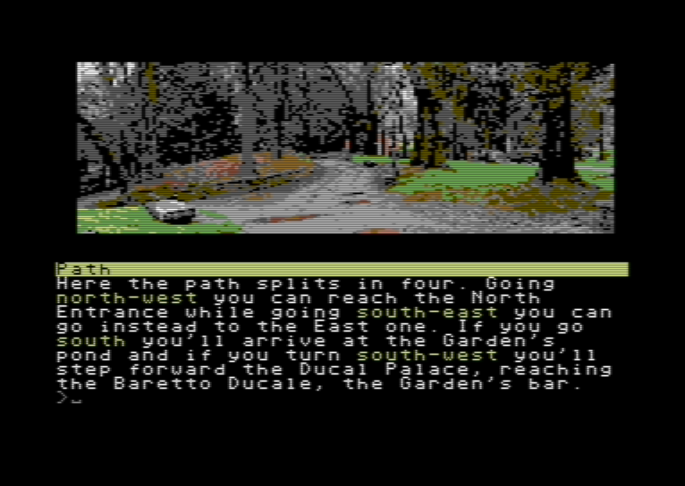

# StoryTllrC64
A small C interactive fiction engine for C64 [it's currently a work-in-progress]

# Usage
This engine works on the compiled data generate from scripts in a specific proprietary language (see **doc/**)

Compiled data can be used as binary file or a .h file - storytllr64_data.h. 

If you compile the scripts in binary format then you just need to create a .d64 disk image with the engine, the game data (advcartridge) and the other image files.

If you choose to compile the scripts as .h (data for the C project) you need to rebuild the project itsself, and the create the disk with the resulting .prg and the other image files.

# binary builds (easier way)

if you set **config** | **binary:yes** in main game script, script_compiler will build a cartdrige binary file and a (windows) batch file to create a d64 file containing 1) the native player 2) all the game images and 3) that cartdrige file.

That means that you will get a runnable .d64 file from your game script without any need to rebuild the cc65 native player.

This build is a bit slower than the other one because it will load each graphic image from disk when it's needed - but it's the normal way to build a game with more than few graphic locations

sample command (to run inside samples\accuse folder): **..\bin\script_compiler accuse.hjt ..\..\native_player\storytllr64_data.h advcartdrige**

then (in the same folder): **make.bat**

after these commands you'll find your **d64** game inside bin subfolder

# native builds (more complex, but better for small games)

if you set **config** | **binary:no** in main game script, script_compiler will build a set of headers file that must be put inside the native_player folder, in order to build a self-contained prg file.

It's a nice way to proceed if your game is small.

sample command (to run inside samples\accuse folder): **..\bin\script_compiler accuse.hjt ..\..\native_player\storytllr64_data.h advcartdrige**

then (moving into native_compiler folder): **make** (after changing **BINARY = bin/[gamename].prg** part inside Makefile

after these commands you'll get your **prg** game inside bin subfolder
