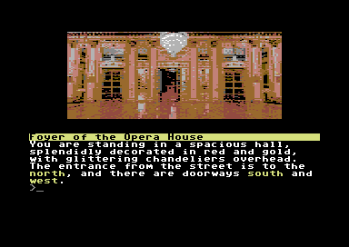

# Cloak of Darkness [C64]

**Cloak of Darkness** (originally made by **Roger Firth** - https://www.ifwiki.org/Roger_Firth) is like a *Hello World* project for an Interactive Fiction engine. It's a classic (really) short story, realized by hundred of developers using several different languages. So it was an easy choice to use it to test the native C64 graphic text adventure I'm working on (with the hope to realize a bigger game).

My game page (it may be an older versione, compared to script/code here): https://marcogiorgini.itch.io/cloak-of-darkness-c64

Game licence: **MIT licence**
